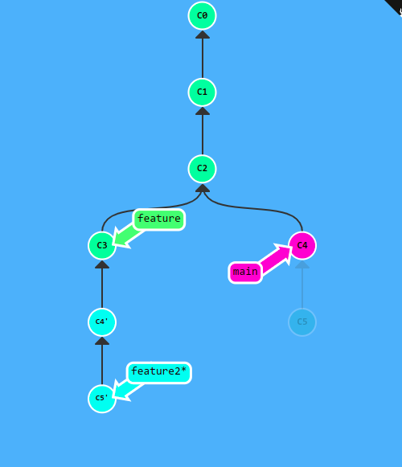

# git challenge
This is the git challenge solution from Group 3 : smart-suitcases (Saïdi Rayane, Mimassi Joseph, Bouhnine Salaheddine, Nys Eliott)

## Goal

## Solution

$ git commit

$ git checkout -b feature

$ git commit

$ git checkout main

$ git checkout -b feature2

$ git commit

$ git commit

$ git checkout main

$ git rebase feature2^

$ git checkout feature2

$ git rebase feature